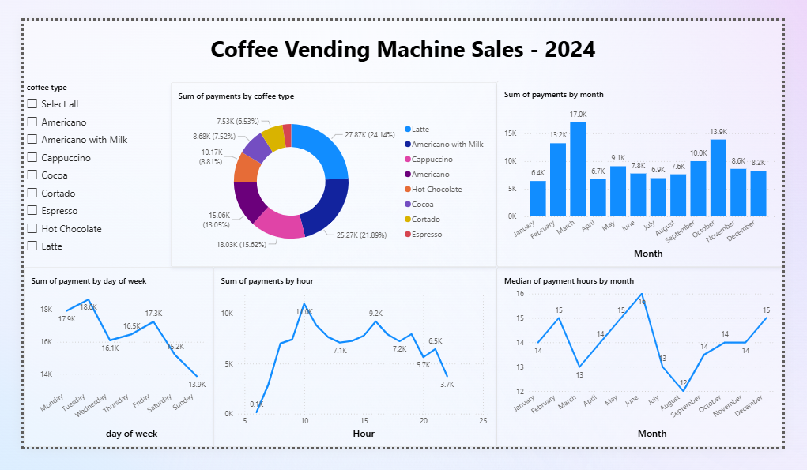
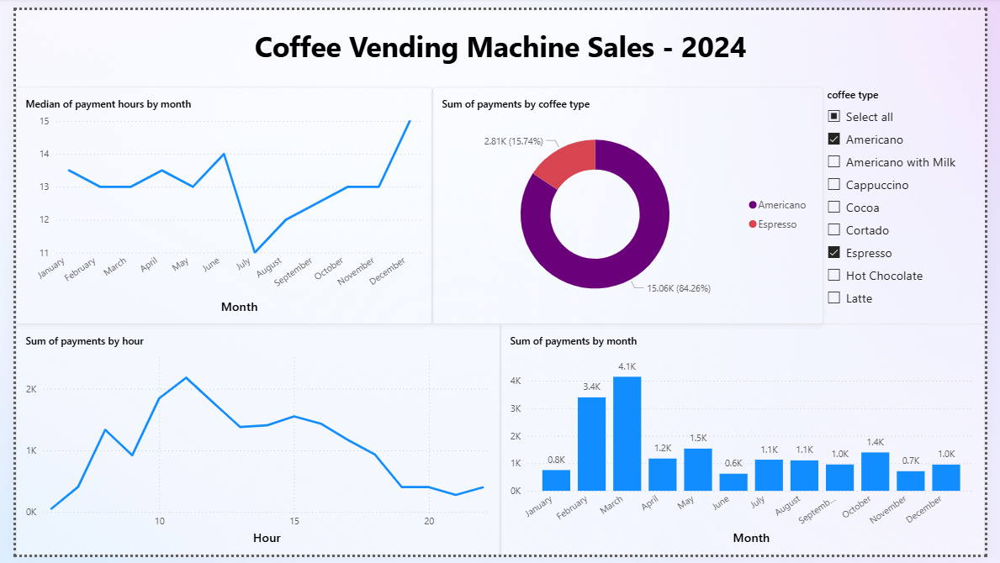

# Coffee Vending Machine Sales Report

This project includes a Power BI report (`report.pbix`) for a coffee vending machine sales dataset including line charts, a column chart, a donut chart, and a slicer, aiming to address specific business questions.

## Table of Contents
- [Business Questions](#business-questions)
- [Screenshots](#screenshots)
- [Patterns and Statistics](#patterns-and-statistics)
- [Insights and Recommendations](#insights-and-recommendations)
- [Attributions](#attributions)

## Business Questions

These are the business questions we are trying to respond to using this report:
1. What are the most and least popular coffee drinks, and what are the most critical ingredients in the coffee vending machine?
2. What is the best time to refill the vending machine? 
3. What should our next marketing campaigns focus on?

## Screenshots

The following is a screenshot of the report for all coffee types.

The following is a screenshot of the report for espresso and americano only.

## Patterns and Statistics

The most popular coffee types are:
1. Latte (~24.1% of sales)
2. Americano with Milk (~21.9% of sales)
3. Cappuccino (~15.6% of sales)

The least popular coffee types are:
1. Espresso (~2.4% of sales)
2. Cortado (~6.5% of sales), which is ~2.7 times more popular than Espresso
3. Cocoa (~7.5% of sales)

Overall sales (sum of payments) increased from January (mid Winter), peaked in March (early Spring), and then dropped dramatically in April (mid Spring) with ~2.5 times fewer sales.
Overall sales decreased from May (late Spring) to July (mid Summer) and increased from July (mid Summer) to October (mid Fall).

Overall, sales tend to be lower in the warmest and coldest months.

The lowest non-zero sales occurred in the 6-7 o'clock time slot. The sales increased until it peaked in the 10-11 o'clock time slot, and started decreasing. The second-highest peak occurred in the 16-17 o'clock time slot. 

It appears that the highest sales in an hour occurred a little after the start and a little before the end of the workday.

The median of payment time slots is always in the 12-13 o'clock time slot to the 16-17 o'clock time slot range. The median increased from March (early Spring) and peaked in June (early Summer), then decreased and dipped in August (late Summer). The median hour increased from August (late Summer) to December (early Winter).

It appears that overall, the median of payment time slots is highest in the warmest and coldest months.

Using the slicer, we can see that Americano is visibly more popular in February (late Winter) and March (early Spring).

The following are the days of week with the highest sales:
1. Tuesday (~18.6k sales)
2. Monday (~17.9k sales)

The following are the days of week with the lowest sales:
1. Sunday (~13.9k sales)
2. Saturday (~15.2k sales)

## Insights and Recommendations

**1. What are the most and least popular coffee drinks, and what are the most critical ingredients in the coffee vending machine?**

The most popular coffee types are Latte (~24.1% of sales), Americano with Milk (~21.9% of sales), and Cappuccino (~15.6% of sales).
The least popular coffee type is Espresso (~2.4% of sales), and the next least popular coffee type is Cortado (~6.5% of sales), which is ~2.7 times more popular than Espresso.
It's important to note that even though Espresso itself is the least popular drink, it's a common ingredient of the most popular coffee types.
The top 3 most popular drinks all include espresso and milk, which suggests these two are the most critical ingredients, and it's important to make sure vending machine do not run out of espresso or milk.

**2. What is the best time to refill the vending machine?**

It's best to refill the vending machine between 11 pm and 6 am, which had zero sum of payments.

**3. What should our next marketing campaigns focus on?**

It can be a good option to focus on increasing sales in the coldest and warmest months, where sales seem to be lower than in other months. We need to conduct surveys to better understand the reasons for the drop in sales during these months to increase the effectiveness of the marketing campaigns.

Tuesday (with ~18.6k sales) and Monday (with ~17.9k sales), the days in the beginning of the work week have the highest overall sales. Sunday (with ~13.9k sales) and Saturday (with ~15.2k sales), the weekend days have the lowest overall sales. Another potential focus for the marketing campaigns can be the weekend sales.

## Attributions
The <a href="https://www.kaggle.com/">Kaggle</a> dataset used for this report
<a href="https://www.kaggle.com/datasets/ihelon/coffee-sales">Coffee Sales dataset</a> 
by <a href="https://www.kaggle.com/ihelon">Yaroslav Isaienkov</a> 
is licensed under <a href="https://creativecommons.org/publicdomain/zero/1.0/">CC0: Public Domain</a>.

